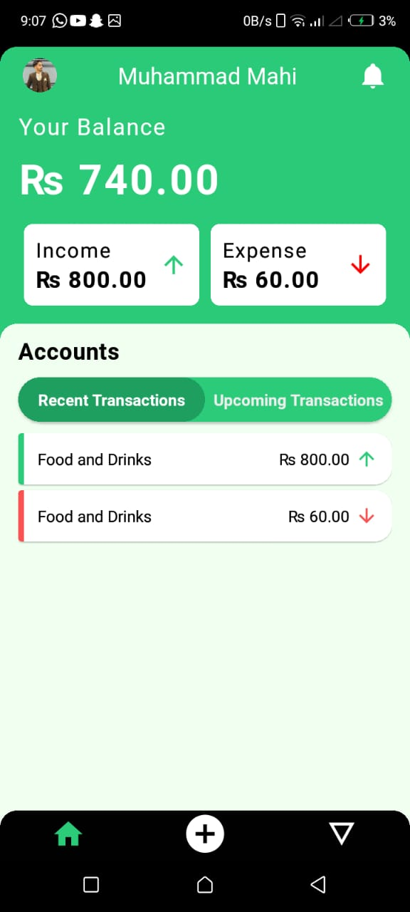

# An Expense Tracker Application

Chibi Coin an Expense Tracker Application built for a project with the following features:

## Features

- **Authentication**
- **Notifications**
- **Expense Tracking**
- **Goals**
- **Budgets**
- **Profile**
- **Currency Conversion**

## Known Issues

The application currently lacks complete backend with notification module just hardcoded. The budget module has data type conversion that renders it useless.

## APK

https://drive.google.com/drive/folders/1potCprBms0YUbV9mBDkqdbyzlo167yuZ?usp=drive_link

### QR APK


## How to Start

```bash

npm uninstall -g expo-cli
npm install expo@latest --legacy-peer-deps
npm start

```

## UI Colors

- **#f2fff1**
- **#34c759**
- **#2BCB79**
- **#21CE99**
- **#fa5252**
- **#02192B**
- **#fa5252**

## Screenshots

### Login


### Homepage



### Goals


### Profile


### Notifications


### Transaction Details


### Create Transactions


### Create Goal


### Edit Goal


